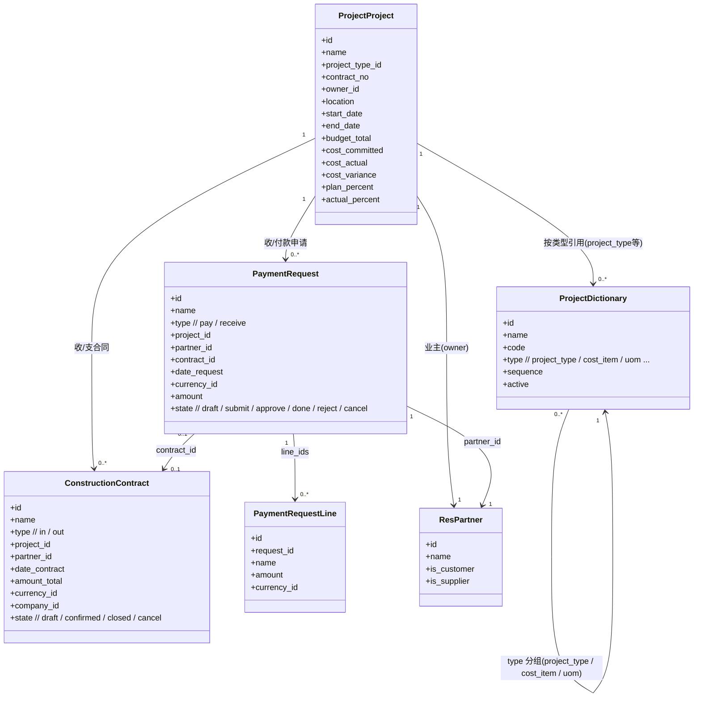
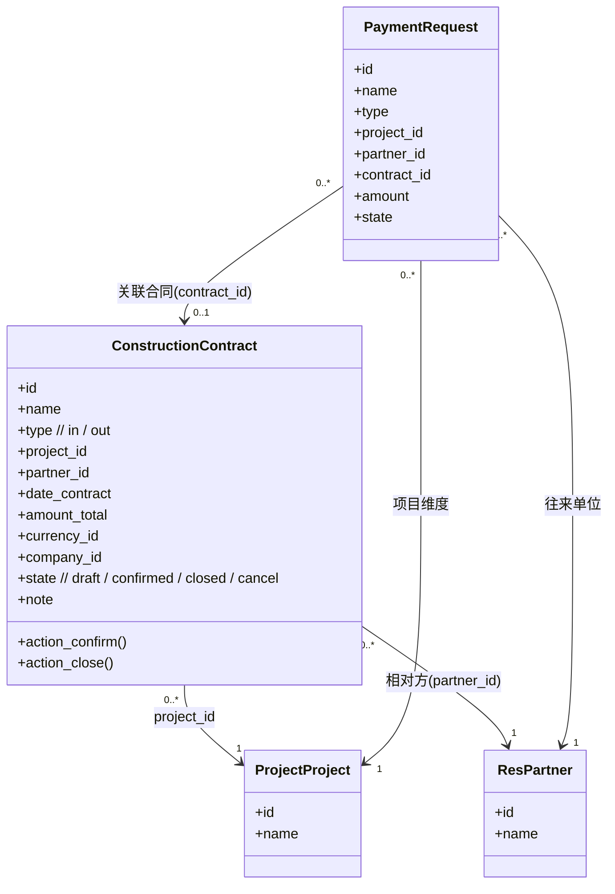
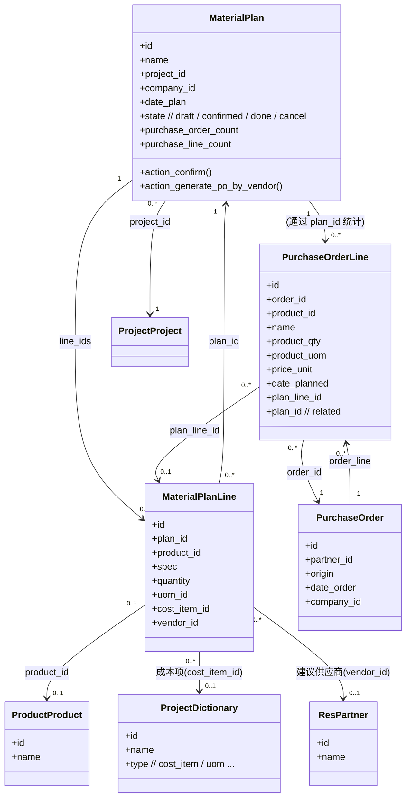
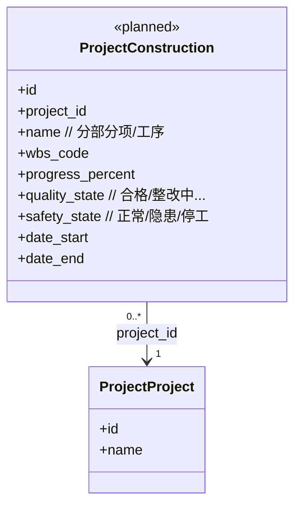
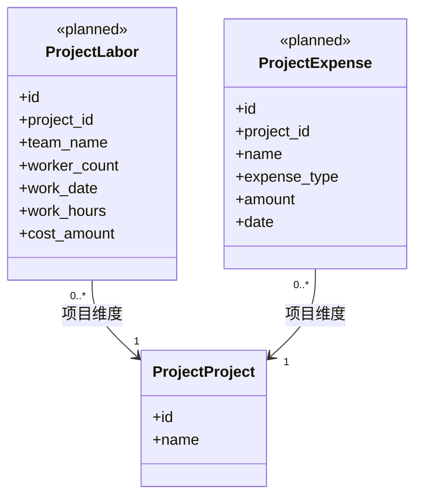
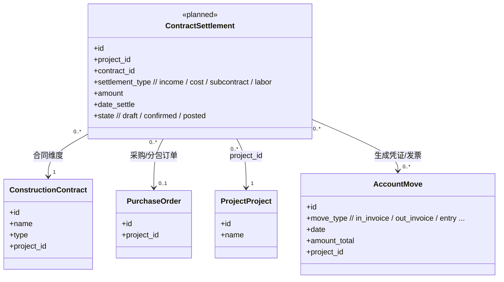
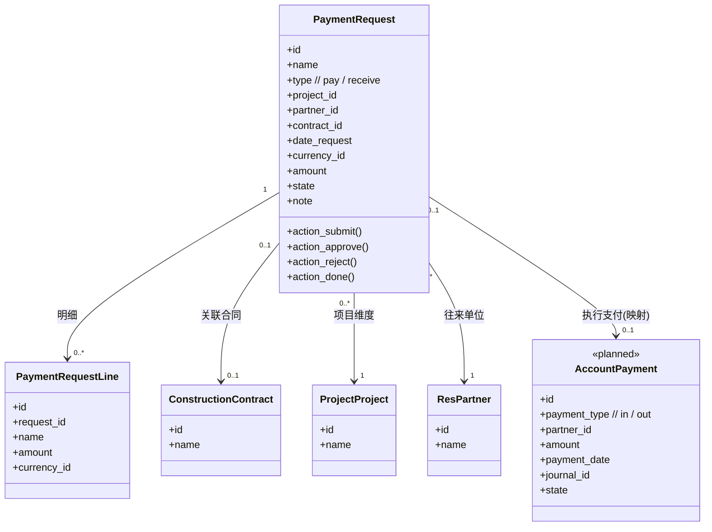
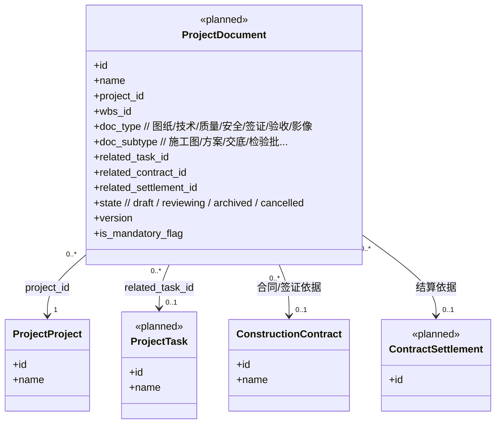
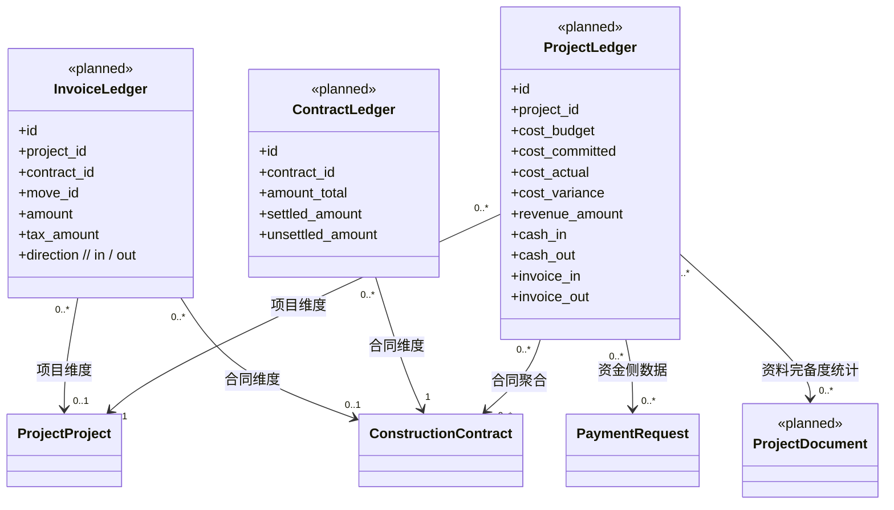
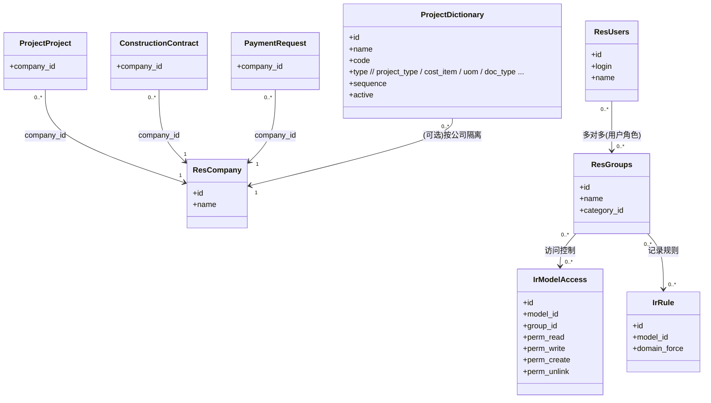

# Smart Construction 2.0

六大中心 · 分中心详细设计文档（完整版 v1.0）

> 适用于产品文档库 / GitHub docs / 系统方案 / 投标文件  
> 结构：定义 → 业务定位 → 目标 → 模块结构 → 数据模型 → 关键流程 → 权限模型 → 前后端交互 → AI 增强能力

---

# 1️⃣ 项目中心（Project Center）

## 定义
项目全生命周期的主域，贯穿立项 → 招投标 → 预算 → 执行 → 收尾，作为其他中心的“项目维度索引”与数据锚点。

## 业务定位
- 跨部门协同主战场
- 项目主数据与全过程状态的唯一来源
- 驱动预算、合同、物资、财务的联动
- 沉淀项目知识库

## 核心目标
- 建立项目主数据与统一状态机
- 支撑预算/合同/物资/财务等域的项目索引
- 提供驾驶舱级项目运行可视化

## 模块结构（9 大能力模块）

### 1. 项目立项（Project Initiation）
- 功能：基础信息、分类属性（直营/联营）、项目类型、规模指标、立项附件（批文/可研/许可）。
- 模型（示例字段）：
  ```
  project.project
    name, code, project_type, manage_type, owner_id,
    contract_scale, location, start_plan, end_plan, docs
  ```
- 流程：立项 → 评审 → 生效 → 进入驾驶舱/投标
- 权限：项目经理（读写）、领导（审核）、财务/成本（只读）

### 2. 项目驾驶舱（Project Dashboard）
- 功能：关键指标一张图（进度/成本/合同/物资/文档），里程碑，成本偏差，风险预警（AI）。

### 3. 项目列表（Project List）
- 功能：按区域/状态/负责人/类型分组、过滤、排序与批量操作。

### 4. WBS / 分部子项（WBS & Sub-Projects）
- 功能：工程结构树（分部/分项/检验批/部位），与清单/任务/验收联动，三算对齐。
- 模型示例：
  ```
  project.wbs
    project_id, parent_id, level_type, name, code,
    uom_id, quantity, work_id (工程结构)
  ```
- 流程：创建结构 → 绑定清单 → 生成任务

### 5. 投标管理（Tender & Bid）
- 功能：公告 → 标书购买 → 踏勘 → 文件审查 → 投标报价（含清单） → 开标登记 → 中标（自动生成收入合同）。
- 状态流：prepare → estimating → submitted → waiting → won/lost
- 子模块：公告、标书购买、踏勘、审查、报价清单、开标登记

### 6. 项目预算（Cost Budget）
- 功能：多版本预算（V1/V2/V3），科目树与工程结构对齐，预算审批，预算对比（预算 vs 清单 vs 实际）。

### 7. 合同汇总（Project Contracts Overview）
- 功能：项目内收入/成本合同总览、变更与执行进度。

### 8. 工程资料中心（Document Center）
- 功能：技术/质量/安全/过程资料，版本管理，目录模板（AI 可生成）。

### 9. 工程结构（Engineering Structure）
- 功能：工程结构树与 WBS 深度绑定，任务/物资/验收依据。

### 10. 工程量清单（BOQ）
- 功能：清单导入、拆分、自动生成结构、工程量统计，驱动物资计划与任务生成。

## 数据模型（核心拆分）
- `project.project`：项目主档案（基础信息、状态、负责人、预算/成本汇总）
- `project.wbs` / `construction.work.breakdown`：工程结构树（分部/分项/检验批）
- `project.boq.line`：工程量清单行（project_id, code, name, spec, uom, qty, price, amount, wbs_id, task_id）
- `tender.bid` 及子表：投标全流程（标书购买、踏勘、审查、开标、保证金）

## 关键流程
- 立项 → 评审 → 生效
- 招投标：prepare → estimating → submitted → waiting → won/lost → 自动建合同
- 清单导入 → WBS 绑定 → 任务生成
- 预算版本 → 审批 → 对比执行

## 权限模型（示例）
- 项目经理：项目读写、投标流程操作
- 成本负责人：预算读写、成本对比
- 领导/审批：立项/预算/合同/投标审批
- 只读角色：财务、资料等

## 前后端交互（接口示例）
- REST/OpenAPI：`/api/projects`, `/api/projects/{id}/wbs`, `/api/tenders`, `/api/boq/import`
- 事件流：状态变更 webhook（项目/投标/合同）、清单导入完成事件
- 前端：Vue + statusbar/按钮驱动状态机，表单页签（清单、附件、踏勘、审查、开标、保证金）

## AI 增强能力
- 风险预警（进度/成本/投标成功率）
- 自动生成资料目录、任务拆解、预算对比分析
- 投标文件审查、开标竞争对手分析

---

# 2️⃣ 合同中心（Contract Center）

## 定义
统一管理收入/支出合同，覆盖谈判、签约、变更、计量、执行。

## 模块结构
- 收入合同（type=out）：中标合同、条款、计量方式、变更、收款计划/记录；状态：draft → approval → active → completed
- 成本合同（type=in）：分包/材料/外协/租赁合同，付款计划、发票、风险点
- 合同变更：变更/签证申请 → 审批 → 更新合同金额
- 合同执行：计量计价、付款审批、合同余额、超预算预警

## 数据模型
- `construction.contract`：type, project_id, partner_id, amount_final, state(draft/confirmed/running/closed/cancel), pay_plan_ids, line_ids
- `contract.variation`（示例）：contract_id, change_type, amount, attachment

## 权限
- 合同管理员（读写/审批）、项目经理（读/部分写）、财务（只读/执行收付款）、领导（审批）

## AI 增强
- 合同条款风险提示、变更影响分析、支付计划优化

---

# 3️⃣ 成控中心（Cost Control Center）

## 定义
聚焦“事前/事中/事后”成本管控：预算、执行、偏差、现金流。

## 模块结构
- 成本台账：材料/人工/机械/分包/费用成本，核算与分摊  
  `cost.ledger(project_id, cost_type, amount, related_doc)`
- 成本预算：预算版本、科目树、审批
- 成本偏差分析：预算 vs 清单 vs 实际，AI 差异原因
- 收支平衡：月度收入/支出、现金缺口预警

## AI 增强
- 偏差诊断、预算优化建议、现金流预测

---

# 4️⃣ 物资中心（Material Center）

## 模块结构
- 物资计划：来自 BOQ/任务自动生成 `material.plan(wbs_id, material_id, qty)`
- 采购管理：询价/比价/下单/到货/发票/入库
- 库存管理：仓库/批次/入出库/库龄
- 材料成本核算：消耗、损耗、成本归集

## AI 增强
- 物资需求预测、供应商评分与推荐、库存优化

---

# 5️⃣ 财务中心（Finance Center）

## 模块结构
- 收款：计划、回款记录、开票
- 付款：申请、审批、执行、发票管理
- 财务报表：项目利润表、现金流表、合同收支表

## AI 增强
- 回款风险预警、付款优先级建议、财务健康度评分

---

# 6️⃣ 数据中心（Data Center）

## 模块结构
- 数据字典：项目类型、物资分类、工程结构类型、合同类型、预算/清单科目等
- AI 分析：`ai.analysis.log(project_id, task, ai_plan_brief, ai_risk_summary, ai_doc_recommend)`
- BI 报表：成本/合同/项目/物资可视化
- 系统配置：用户、角色、权限、审批流、通知

---

# 菜单重构建议
```
项目中心
    - 项目立项
    - 项目驾驶舱
    - 项目列表
    - WBS/分部子项
    - 投标管理
    - 项目预算
    - 合同汇总
    - 工程资料中心
    - 工程结构
    - 工程量清单

合同中心
    - 收入合同
    - 成本合同
    - 合同变更
    - 合同执行

成控中心
    - 成本台账
    - 成本偏差分析
    - 成本预算版本
    - 收支平衡

物资中心
    - 物资计划
    - 物资采购
    - 库存管理
    - 物资成本核算

财务中心
    - 收款管理
    - 付款管理
    - 财务报表

数据中心
    - 数据字典
    - AI 分析
    - 报表中心
    - 系统配置
```

---

# 领域级 UML（A–H 八大中心，Mermaid）

> 说明：下列为“领域级 UML”，挑核心字段与关系，标注已实现与 «planned» 规划模型，可直接放入支持 mermaid 的文档/站点渲染。

## A. 项目中心（Project Center）



## B. 合同中心（Contract Center）



## C. 执行中心（Execution Center）

### C1. 物资执行（物资计划 → 采购）



### C2. 施工执行 — «planned»



### C3. 劳务 & 费用执行 — «planned»



## D. 结算中心（Settlement Center）— «planned»



## E. 资金中心（Treasury Center）



## F. 工程资料中心（Engineering Document Center）— «planned»



## G. 台账与报表中心（Ledger & BI Center）— «planned»



## H. 平台支撑域（Platform & Dictionary & Security）



---

# 后续待补充（占位）
- 各中心数据库 ER 图
- 各中心接口设计文档（OpenAPI）
- 各中心前端页面结构图（Vue）
- 各中心开发任务分解（WBS）
- 产品白皮书 v1.0
- 系统蓝图海报（高清 PNG）
