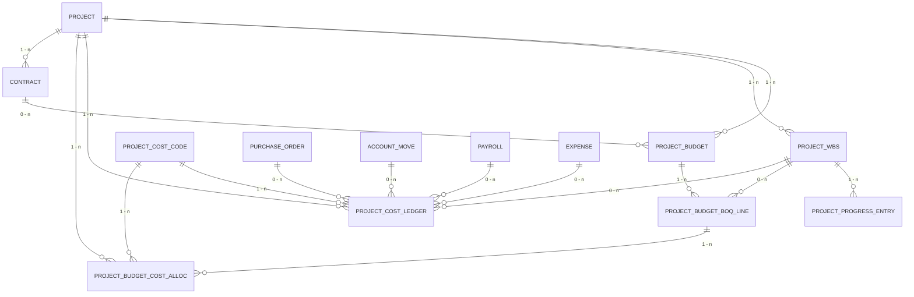

下面的文档描述 Smart Construction 成本域 v1.0 的核心概念，包含 ERD 与模型说明，可直接被 MkDocs 引用。

---

# Smart Construction · 成本域模型（v1.0）

## 1. 整体 ERD

### 三个世界 + 一座桥

| 世界 | 模型 | 说明 |
| --- | --- | --- |
| 预算世界 | `project.budget`, `project.budget.boq.line` | 支撑多版本预算与清单行（BOQ） |
| 进度世界 | `project.wbs`, `project.progress.entry` | 现场分部分项与实际完成量 |
| 成本世界 | `project.cost.code`, `project.cost.ledger` | 人材机管税等成本归集科目与明细台账 |
| 桥表 | `project.budget.cost.alloc` | 解决 BOQ 行与成本科目多对多映射 |

所有对象以 `project.project` 为主键来源，合同、采购、会计、工资等单据通过写入 `project.cost.ledger` 来形成统一事实表，方便实时对比预算 vs 实际成本。

---

## 2. 模型定位速览

- **ProjectBudget (`project.budget`)**  
  某项目的预算头，可按投标版/控制版/调整版迭代；统计目标收入、目标成本与毛利。

- **ProjectBudgetBoqLine (`project.budget.boq.line`)**  
  预算清单/目标成本行，可关联 WBS，并定义计量/确认规则。

- **ProjectCostCode (`project.cost.code`)**  
  成本科目树，按人工、材料、机械、分包、措施费、管理费、税金等分类。

- **ProjectCostLedger (`project.cost.ledger`)**  
  成本台账，所有采购、结算、工资、费用等单据写入此表，构成成本事实。

- **ProjectBudgetCostAlloc (`project.budget.cost.alloc`)**  
  BOQ 行与成本科目之间的分摊表，可记录比例或预算金额，实现多对多映射。

- **ProjectWbs (`project.wbs`)**  
  项目分部分项/构件树，提供按区段/部位的颗粒度。

- **ProjectProgressEntry (`project.progress.entry`)**  
  对 WBS 的进度计量记录，用于计算应确认收入与产值。

---

## 3. 典型报表路径

1. **按成本科目**  
   `project.cost.ledger` → `project.cost.code`：实际成本 vs `project.budget.cost.alloc` 归集的预算成本。

2. **按 BOQ / 分部分项**  
   `project.budget.boq.line`（预算） ↔ `project.wbs` ↔ `project.cost.ledger`（实际成本） ↔ `project.progress.entry`（完成量/产值）。

3. **合同关联**  
   `project.project` → `construction.contract` → `project.budget`：支持“一项目多合同、多版本预算”。

通过该结构，可以在任意项目上做出“预算收入侧 vs 实际成本侧”的实时分析，并在成本台账中追溯每一笔费用的来源单据。  
