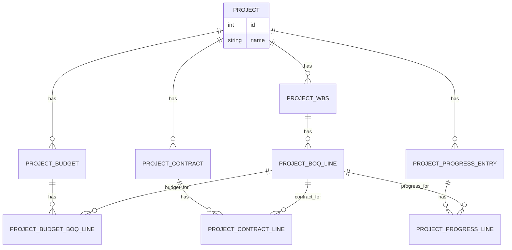

# 成本域 ER 图（Phase-1）

> 先用 Mermaid 画逻辑结构图，后续可以再输出为图片。

```mermaid
erDiagram

  PROJECT {
    int id
    string name
  }

  PROJECT ||--o{ PROJECT_BUDGET : has
  PROJECT_BUDGET ||--o{ PROJECT_BUDGET_BOQ_LINE : has
  PROJECT ||--o{ PROJECT_CONTRACT : has
  PROJECT_CONTRACT ||--o{ PROJECT_CONTRACT_LINE : has
  PROJECT ||--o{ PROJECT_PROGRESS_ENTRY : has
  PROJECT_PROGRESS_ENTRY ||--o{ PROJECT_PROGRESS_LINE : has

  PROJECT ||--o{ PROJECT_WBS : has
  PROJECT_WBS ||--o{ PROJECT_BOQ_LINE : has

  PROJECT_BOQ_LINE ||--o{ PROJECT_BUDGET_BOQ_LINE : budget_for
  PROJECT_BOQ_LINE ||--o{ PROJECT_CONTRACT_LINE : contract_for
  PROJECT_BOQ_LINE ||--o{ PROJECT_PROGRESS_LINE : progress_for
```

> 后续引入变更 / 签证 / 结算时，在本文件继续扩展即可。
