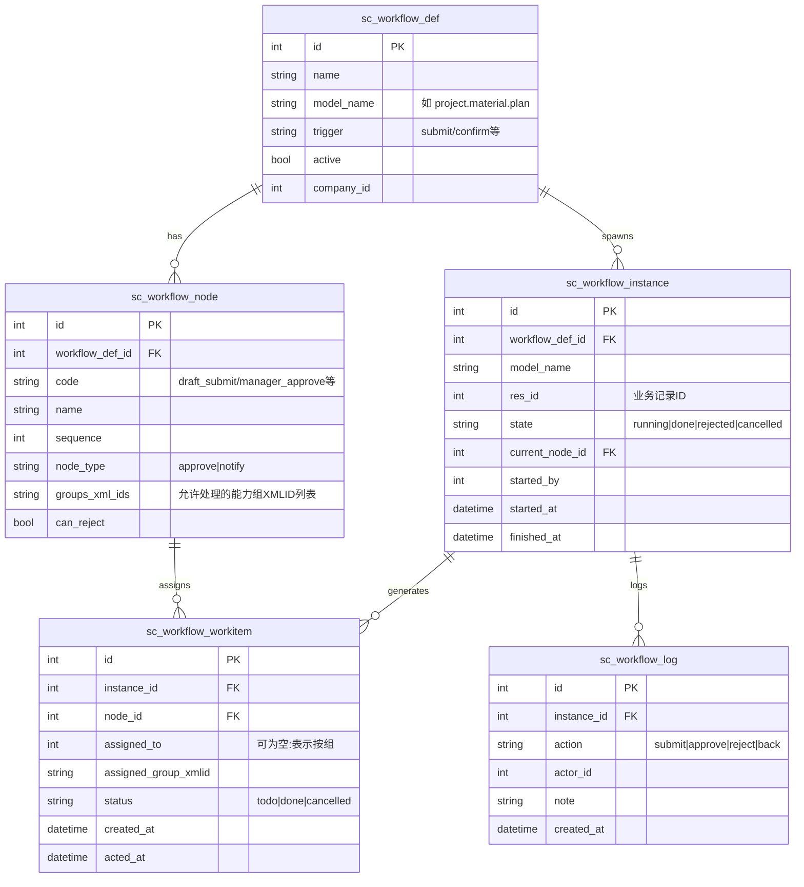

```mermaid
erDiagram
  sc_workflow_def ||--o{ sc_workflow_node : has
  sc_workflow_def ||--o{ sc_workflow_instance : spawns
  sc_workflow_instance ||--o{ sc_workflow_workitem : generates
  sc_workflow_instance ||--o{ sc_workflow_log : logs
  sc_workflow_node ||--o{ sc_workflow_workitem : assigns

  sc_workflow_def {
    int id PK
    string name
    string model_name "如 project.material.plan"
    string trigger "submit/confirm等"
    bool active
    int company_id
  }

  sc_workflow_node {
    int id PK
    int workflow_def_id FK
    string code "draft_submit/manager_approve等"
    string name
    int sequence
    string node_type "approve|notify"
    string groups_xml_ids "允许处理的能力组XMLID列表"
    bool can_reject
  }

  sc_workflow_instance {
    int id PK
    int workflow_def_id FK
    string model_name
    int res_id "业务记录ID"
    string state "running|done|rejected|cancelled"
    int current_node_id FK
    int started_by
    datetime started_at
    datetime finished_at
  }

  sc_workflow_workitem {
    int id PK
    int instance_id FK
    int node_id FK
    int assigned_to "可为空:表示按组"
    string assigned_group_xmlid
    string status "todo|done|cancelled"
    datetime created_at
    datetime acted_at
  }

  sc_workflow_log {
    int id PK
    int instance_id FK
    string action "submit|approve|reject|back"
    int actor_id
    string note
    datetime created_at
  }
```
